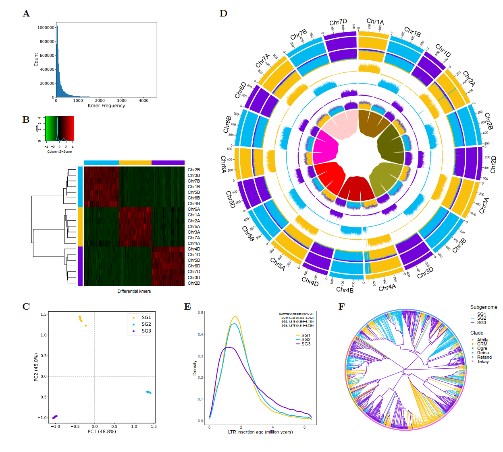

## Table of Contents

   * [Introduction](#Introduction)
   * [Installation](#Installation)
   * [Subgenome phasing with WGDI](#Subgenome-phasing-with-WGDI)
   * [Subgenome phasing with SubPhaser](#Subgenome-phasing-with-SubPhaser)

### Introduction ###
This is an example to phase subgenomes of an allopolyploid complex using 
[WGDI](https://github.com/SunPengChuan/wgdi) and [SubPhaser](https://github.com/zhangrengang/SubPhaser)). 
Here we use the data of 
wheat complex (tetraploid–hexaploid reticulate allopolyploidization) as the example. 
The complex include an allotetraploid (AABB, Triticum turgidum, 2n = 4x = 28) and an allohexaploid (AABBDD, T. aestivum, 2n = 6x = 42).
Less than 0.8 million years ago (mya), a hybridization event between AA (T. urartu) and BB 
(a close relative of Aegilops speltoides) genomes
gave rise to the allopolyploid T. turgidum genome (AABB).
Subsequently, less than 0.4 mya, emmer wheat (AABB) hybridized with another wild wheat species
carrying the D genome (A. tauschii), resulting in the allohexaploid T. aestivum genome (AABBDD).
We assume that the diploid progenitors of allopolyploid wheats were either extinct or not sampled during the subgenome phasing process.

### Installation ###
Firstly, we need to install the required software ([WGDI](https://github.com/SunPengChuan/wgdi) and [SubPhaser](https://github.com/zhangrengang/SubPhaser)) for this example.
Here, we just install the software and dependencies via [conda](https://www.anaconda.com/).
```
git clone https://github.com/zhangrengang/SubPhaser
cd SubPhaser
conda env create -f SubPhaser.yaml -n SGphasing
conda activate SGphasing
python setup.py install

conda install -c bioconda wgdi diamond aster phytop newick_utils
```

### Subgenome phasing with WGDI ###
#### Prepare input data ####

1. Genomic data (protein sequences in fasta format and gene coordinates in custom gff format) of the allopolyploid complex are required.
2. Genomic data of potential diploid progenitors as far as possible are recommended (here is omitted).
3. Genomic data of outgroup or [ancestral karyotype](https://github.com/SunPengChuan/wgdi-example/blob/main/Karyotype_Evolution.md) are required.
4. Configure files for WGDI.

Here, we just use the example data [T. aestivum (AABBDD) and T. turgidum (AABB), and the outgroup Hordeum vulgare] prepared in this repo:
```
git clone https://github.com/zhangrengang/subgenome_phasing_example
cd subgenome_phasing_example
cd wgdi
gunzip *gz
cat *.pep > pep.faa
cat *.cds > cds.fa
```
Now, all the required input data are present:
```
$ tree
├── ak.txt    # karyotype of the reference Hordeum_vulgare
├── Hordeum_vulgare.fasta
├── Hordeum_vulgare.gff
├── Hordeum_vulgare.lens
├── Triticum_aestivum.fasta
├── Triticum_aestivum.gff
├── Triticum_aestivum-Hordeum_vulgare.conf
├── Triticum_aestivum.lens
├── Triticum_aestivum-Triticum_aestivum.conf
├── Triticum_turgidum.fasta
├── Triticum_turgidum.gff
├── Triticum_turgidum-Hordeum_vulgare.conf
├── Triticum_turgidum.lens
├── Triticum_turgidum-Triticum_aestivum.conf
└── Triticum_turgidum-Triticum_turgidum.conf
```
#### Run BLAST search ####
Blast results are also required for WGDI. Here, we run the pairwise BLAST search using DIAMOND:
```
diamond blastp -d Triticum_turgidum.pep -q Triticum_turgidum.pep -o Triticum_turgidum-Triticum_turgidum.blast --more-sensitive -p 40 --quiet -e 0.001
diamond blastp -d Triticum_turgidum.pep -q Triticum_aestivum.pep -o Triticum_turgidum-Triticum_aestivum.blast --more-sensitive -p 40 --quiet -e 0.001
diamond blastp -d Triticum_turgidum.pep -q Hordeum_vulgare.pep -o Triticum_turgidum-Hordeum_vulgare.blast --more-sensitive -p 40 --quiet -e 0.001
diamond blastp -d Triticum_aestivum.pep -q Triticum_aestivum.pep -o Triticum_aestivum-Triticum_aestivum.blast --more-sensitive -p 40 --quiet -e 0.001
diamond blastp -d Triticum_aestivum.pep -q Hordeum_vulgare.pep -o Triticum_aestivum-Hordeum_vulgare.blast --more-sensitive -p 40 --quiet -e 0.001
```
These processes can be speed up by increasing `-p` or parallel computation.

#### Detect synteny and calculate Ks ####
These are basic steps:
```
wgdi -icl Triticum_turgidum-Triticum_aestivum.conf
wgdi -ks Triticum_turgidum-Triticum_aestivum.conf
wgdi -bi Triticum_turgidum-Triticum_aestivum.conf

wgdi -icl Triticum_turgidum-Hordeum_vulgare.conf
wgdi -ks Triticum_turgidum-Hordeum_vulgare.conf
wgdi -bi Triticum_turgidum-Hordeum_vulgare.conf

wgdi -icl Triticum_aestivum-Triticum_aestivum.conf
wgdi -ks Triticum_aestivum-Triticum_aestivum.conf
wgdi -bi Triticum_aestivum-Triticum_aestivum.conf

wgdi -icl Triticum_aestivum-Hordeum_vulgare.conf
wgdi -ks Triticum_aestivum-Hordeum_vulgare.conf
wgdi -bi Triticum_aestivum-Hordeum_vulgare.conf
```

#### [Optional] Seek evidence from Ks-colored dot plots ####
To show Ks-colored dot plots:
```
wgdi -bk Triticum_turgidum-Triticum_aestivum.conf
wgdi -bk Triticum_aestivum-Triticum_aestivum.conf
```
From the dot plots `Triticum_turgidum-Triticum_aestivum.blockks.png` (below figure), we can find that the D subgenome of Triticum_aestivum shows 
higher Ks to Triticum_turgidum, while A or B subgenomes of Triticum_aestivum show lower Ks to Triticum_turgidum. Thus, the D subgenome as a singleton
can be phased out.

We hypothesize the A or B subgenome may be closer to the D subgenome. However, there is no such a pattern that Ks(A-D) is higher or lower than Ks(B-D) to distinguish A and B subgenomes (below figure).


#### Assign subgenome preliminarily ####
Fisrt, we need to identify orthologous synteny between the outgroup reference and the polyploids, 
and to visually validate with the Ks-colored dot plots:
```
wgdi -c Triticum_turgidum-Hordeum_vulgare.conf
wgdi -bk Triticum_turgidum-Hordeum_vulgare.conf

wgdi -c Triticum_aestivum-Hordeum_vulgare.conf
wgdi -bk Triticum_aestivum-Hordeum_vulgare.conf
```
If there are non-orthologous syntenic blocks in the dot plots, we need to adjust the parameters (including `homo`, `multiple` and `pvalue`) 
for `wgdi -c`, and re-run the above commands.

Then, we map the karyotype of polyploids to the reference:
```
wgdi -km Triticum_turgidum-Hordeum_vulgare.conf
wgdi -km Triticum_aestivum-Hordeum_vulgare.conf
```
This step generates the mapping files of polyploids: `Triticum_turgidum.ancestor.txt` and `Triticum_aestivum.ancestor.txt`.

At this stage, we need to manually eidt the two files to assign subgenomes. 
We have phased the D subgenome based on Ks-based evidence, 
so we number the blocks of D subgenome as 3, but randomly number those of A or B subgenomes as 1 or 2: 
```
$ cat Triticum_aestivum.ancestor.txt
1A      1       4359    RoyalBlue       2
1B      1       4736    RoyalBlue       1
1D      1       4487    RoyalBlue       3
2A      1       5840    red     1
2B      1       6152    red     2
2D      1       5885    red     3
3A      1       5237    #99CC00 1
3B      1       5941    #99CC00 2
3D      1       5306    #99CC00 3
4A      1       3027    deepskyblue     1
4A      3028    3593    #339966 1
4A      3594    3907    fuchsia 2
4A      3908    4056    deepskyblue     1
4A      4057    4870    fuchsia 2
4B      1       3878    deepskyblue     2
4D      1       3582    deepskyblue     3
5A      1       4772    #339966 1
5A      4773    5450    deepskyblue     1
5B      1       5574    #339966 2
5D      1       5574    #339966 3
6A      1       4141    #FFCC00 2
6B      1       4627    #FFCC00 1
6D      1       4012    #FFCC00 3
7A      1       5573    fuchsia 2
7B      1       4892    fuchsia 1
7D      1       5419    fuchsia 3

$ cat Triticum_turgidum.ancestor.txt
1A      1       3906    RoyalBlue       2
1B      1       4136    RoyalBlue       1
2A      1       5192    red     1
2B      1       5463    red     2
3A      1       4956    #99CC00 1
3B      1       5832    #99CC00 2
4A      1       2869    deepskyblue     1
4A      2870    3347    #339966 1
4A      3348    3447    deepskyblue     1
4A      3448    4385    fuchsia 2
4B      1       3487    deepskyblue     2
5A      1       4057    #339966 1
5A      4058    4677    deepskyblue     1
5B      1       5037    #339966 2
6A      1       3651    #FFCC00 2
6B      1       4017    #FFCC00 1
7A      1       4880    fuchsia 2
7B      1       4244    fuchsia 1
```
#### Reconstruct phylogeny by chromosomes and refine the assignments with the phylogeny-based evidence ####
Now, we can apply the assignments and seek the phylogeny-based evidence:
```
wgdi -pc Triticum_turgidum-Hordeum_vulgare.conf
wgdi -a Triticum_turgidum-Hordeum_vulgare.conf

wgdi -pc Triticum_aestivum-Hordeum_vulgare.conf
wgdi -a Triticum_aestivum-Hordeum_vulgare.conf

paste Triticum_turgidum-Hordeum_vulgare.alignment.csv Triticum_aestivum-Hordeum_vulgare.alignment.csv | perl -pe 's/\t[^,]+//g' > merged.alignment.csv

for chr in $(cut -f1 Hordeum_vulgare.lens)
do
    awk -v chr=$chr '$1==chr' Hordeum_vulgare.lens > Hordeum_vulgare.$chr.lens
    echo "[alignmenttrees]
alignment = merged.alignment.csv
gff = Hordeum_vulgare.gff
lens = Hordeum_vulgare.$chr.lens
dir = Hordeum_vulgare.$chr.tree
sequence_file = pep.faa
trees_file =  Hordeum_vulgare.$chr.trees.nwk
align_software = mafft
tree_software =  iqtree
model = MFP
trimming =  trimal
minimum = 4
delete_detail = true" > Hordeum_vulgare.$chr.conf
    wgdi -at Hordeum_vulgare.$chr.conf
    astral-pro -i Hordeum_vulgare.$chr.trees.nwk -u 2 -t 8 -o Hordeum_vulgare.$chr.trees.nwk.astral
    phytop -pie -cp Hordeum_vulgare.$chr.trees.nwk.astral
    nw_display Hordeum_vulgare.$chr.trees.nwk.astral
done
```
Then, we manually edit the assignments according to the phylogenetic positions:
```
$ cat Triticum_aestivum.ancestor.txt
1A      1       4359    RoyalBlue       1
1B      1       4736    RoyalBlue       2
1D      1       4487    RoyalBlue       3
2A      1       5840    red     1
2B      1       6152    red     2
2D      1       5885    red     3
3A      1       5237    #99CC00 1
3B      1       5941    #99CC00 2
3D      1       5306    #99CC00 3
4A      1       3027    deepskyblue     1
4A      3028    3593    #339966 1
4A      3594    3907    fuchsia 2
4A      3908    4056    deepskyblue     1
4A      4057    4870    fuchsia 2
4B      1       3878    deepskyblue     2
4D      1       3582    deepskyblue     3
5A      1       4772    #339966 1
5A      4773    5450    deepskyblue     1
5B      1       5574    #339966 2
5D      1       5574    #339966 3
6A      1       4141    #FFCC00 1
6B      1       4627    #FFCC00 2
6D      1       4012    #FFCC00 3
7A      1       5573    fuchsia 1
7B      1       4892    fuchsia 2
7D      1       5419    fuchsia 3

$ cat Triticum_turgidum.ancestor.txt
1A      1       3906    RoyalBlue       1
1B      1       4136    RoyalBlue       2
2A      1       5192    red     1
2B      1       5463    red     2
3A      1       4956    #99CC00 1
3B      1       5832    #99CC00 2
4A      1       2869    deepskyblue     1
4A      2870    3347    #339966 1
4A      3348    3447    deepskyblue     1
4A      3448    4385    fuchsia 2
4B      1       3487    deepskyblue     2
5A      1       4057    #339966 1
5A      4058    4677    deepskyblue     1
5B      1       5037    #339966 2
6A      1       3651    #FFCC00 1
6B      1       4017    #FFCC00 2
7A      1       4880    fuchsia 1
7B      1       4244    fuchsia 2
```
We re-run the above commands (`-pc`, `-a`, `-at`) to make a final check.

#### [Optional] Seek evidence from biased fractionation ####

```
wgdi -r Triticum_turgidum-Hordeum_vulgare.conf
wgdi -r Triticum_aestivum-Hordeum_vulgare.conf
```

#### [Optional] Build subgenome phylogeny ####
Then we can build a final subgenome phylogeny:
```
cat Hordeum_vulgare.*.trees.nwk > Hordeum_vulgare.trees.nwk
astral-pro -i Hordeum_vulgare.trees.nwk -u 2 -t 8 -o Hordeum_vulgare.trees.nwk.astral
phytop -pie -cp Hordeum_vulgare.trees.nwk.astral
nw_display Hordeum_vulgare.trees.nwk.astral
```

### Subgenome phasing with SubPhaser ###
#### Prepare input data ####

1. Genomic data (genome sequences in fasta format) of the allopolyploid complex are required.
2. Homoeologous relationships of chromosome are required. These can be obtained from above synteny analyses or whole genome alignments..

Here, we just use the example data [T. aestivum (AABBDD) and T. turgidum (AABB)] prepared in this repo:
```
git clone https://github.com/zhangrengang/subgenome_phasing_example
cd subgenome_phasing_example
cd subphaser

# download genome seqences of Triticum_aestivum
wget https://urgi.versailles.inra.fr/download/iwgsc/IWGSC_RefSeq_Assemblies/v2.1/iwgsc_refseqv2.1_assembly.fa.zip -c && \
    unzip iwgsc_refseqv2.1_assembly.fa.zip && \
    mv iwgsc_refseqv2.1_assembly.fa Triticum_aestivum-genome.fasta && \
    gzip Triticum_aestivum-genome.fasta -f && \
    rm iwgsc_refseqv2.1_assembly.fa.zip

# download genome seqences of Triticum_turgidum
wget -c ftp://ftp.ncbi.nlm.nih.gov/genomes/all/GCA/900/231/445/GCA_900231445.1_Svevo.v1/GCA_900231445.1_Svevo.v1_genomic.fna.gz -O Triticum_turgidum-genome.fasta.gz
```
Now, all the required input data are present:
```
$ tree
├── Triticum_aestivum-genome.fasta.gz
├── Triticum_aestivum-sg.config
├── Triticum_turgidum-genome.fasta.gz
└── Triticum_turgidum-sg.config
```

#### Run SubPhaser ####
```
subphaser -i Triticum_aestivum-genome.fasta.gz -c Triticum_aestivum-sg.config -pre Triticum_aestivum_
subphaser -i Triticum_turgidum-genome.fasta.gz -c Triticum_turgidum-sg.config -pre Triticum_turgidum_
```
Then we need to check whether well phased.

#### [Optional] Convert to WGDI format and build subgenome phylogeny ####
Here for comparison purpose, we convert the output of SubPhaser to the format of WGDI, to build the subgenome phylogeny.

Link files for WGDI:
```
ln ../wgdi/*gff ../wgdi/*lens ../wgdi/*Hordeum_vulgare.conf ../wgdi/ak.txt ../wgdi/*Hordeum_vulgare.blockinfo.new.csv ../wgdi/pep.faa .
```

Convert the output of SubPhaser:
```
cat Triticum_aestivum_phase-results/Triticum_aestivum_k15_q200_f2.bin.group | grep -v "#" | awk '$6>=5{print $1"\t"$2"\t"$3"\t"$4}' > Triticum_aestivum.sg.bed
python ../script/subphaser2wgdi.py Triticum_aestivum.sg.bed Triticum_aestivum.gff Triticum_aestivum.ancestor.txt

cat Triticum_turgidum_phase-results/Triticum_turgidum_k15_q200_f2.bin.group | grep -v "#" | awk '$6>=5{print $1"\t"$2"\t"$3"\t"$4}' > Triticum_turgidum.sg.bed
python ../script/subphaser2wgdi.py Triticum_turgidum.sg.bed Triticum_turgidum.gff Triticum_turgidum.ancestor.txt

```

Build the subgenome phylogeny via WGDI:
```
wgdi -pc Triticum_turgidum-Hordeum_vulgare.conf
wgdi -a Triticum_turgidum-Hordeum_vulgare.conf

wgdi -pc Triticum_aestivum-Hordeum_vulgare.conf
wgdi -a Triticum_aestivum-Hordeum_vulgare.conf

paste Triticum_turgidum-Hordeum_vulgare.alignment.csv Triticum_aestivum-Hordeum_vulgare.alignment.csv | perl -pe 's/\t[^,]+//g' > merged.alignment.csv

echo "[alignmenttrees]
alignment = merged.alignment.csv
gff = Hordeum_vulgare.gff
lens = Hordeum_vulgare.lens
dir = Hordeum_vulgare.tree
sequence_file = pep.faa
trees_file =  Hordeum_vulgare.trees.nwk
align_software = mafft
tree_software =  iqtree
model = MFP
trimming =  trimal
minimum = 4
delete_detail = true" > Hordeum_vulgare.conf

wgdi -at Hordeum_vulgare.conf
astral-pro -i Hordeum_vulgare.trees.nwk -u 2 -t 8 -o Hordeum_vulgare.trees.nwk.astral
phytop -pie -cp Hordeum_vulgare.trees.nwk.astral
nw_display Hordeum_vulgare.trees.nwk.astral
```
